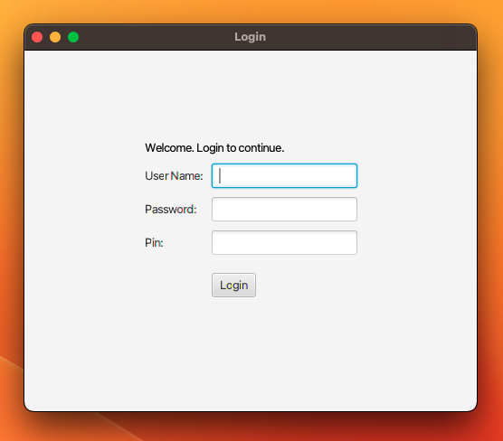

# Audit-Login

<div align="center">
  
</div>

The Audit-Login Application is a Java desktop application that provides a simple login interface for users to enter their username, password, and PIN to access a secured system. This README provides an overview of the application, how to use it, and how to contribute to the project.

## Table of Contents
- [Getting Started](#getting-started)
- [Features](#features)
- [Usage](#usage)
- [Contributing](#contributing)
- [License](#license)

## Getting Started

To get started with the Login Application, follow these steps:

1. Clone this repository to your local machine:

   ```bash
   git clone https://github.com/ameliablack/Audit-Login.git
2. Open the project in your preferred Java IDE (e.g., NetBeans).

3. Compile and run the LoginApp class to start the application.

## Features
The Login Application offers the following features:

- Secure login with username, password, and PIN.
- User authentication against stored usernames and passwords.
- Session management with a limit on unsuccessful login attempts.
- Logging of login and authentication events in an audit log file.
- Simple and intuitive user interface.

## Usage

1. Launch the application by running the `LoginApp` class.

2. Enter your username, password, and PIN in the respective fields.

3. Click the "Login" button to attempt login.

4. If the login information is correct, you will be welcomed to the system.

5. After three unsuccessful login attempts, the application will lock you out. You can try again later.

## Contributing

Contributions to the Login Application are welcome! If you have suggestions for improvements, bug reports, or feature requests, please follow these steps:

1. Fork the repository to your GitHub account.

2. Clone your forked repository to your local machine:
   ```bash
   git clone https://github.com/ameliablack/Audit-Login.git
   
3. Create a new branch for your contribution: 
   ```bash
   git checkout -b feature/your-feature-name
   
6. Make your changes and commit them to your branch.

7. Push your changes to your forked repository:
    ```bash
   git push origin feature/your-feature-name

9. Create a pull request from your forked repository to the original repository.

10. Describe your changes and submit the pull request.

   I appreciate your contributions!

##  License
This project is licensed under the MIT License. See the [LICENSE](LICENSE) file for details.

